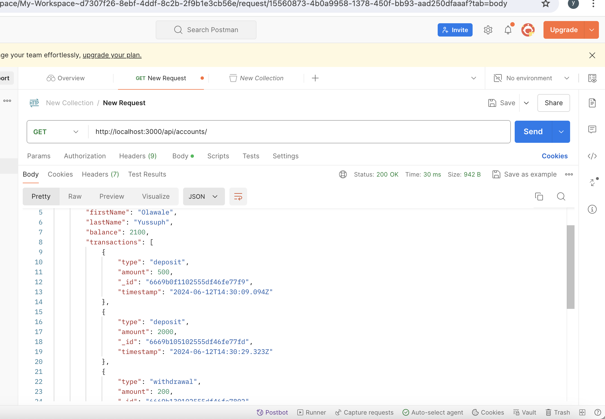

<h2>Bank Simulation Project</h2> 
<h3>Overview</h3>

This project is a simulation of a bank account system built with Node.js, Express.js, and MongoDB. Users can create accounts, deposit and withdraw money, view transaction histories, and transfer money between accounts. The project also includes a daily withdrawal limit feature. The application is dockerized for easy deployment and testing.

<h3>Features</h3>
<li>Create a bank account</li>
<li>Deposit money into the account</li>
<li>Withdraw money from the account (with a daily withdrawal limit)</li>
<li>View transaction history</li>
<li>Transfer money between accounts</li>
<li>Fetch all accounts</li>
<li>Fetch a single account</li>
<li>Delete an account</li>
<li>Update account details</li>

 

